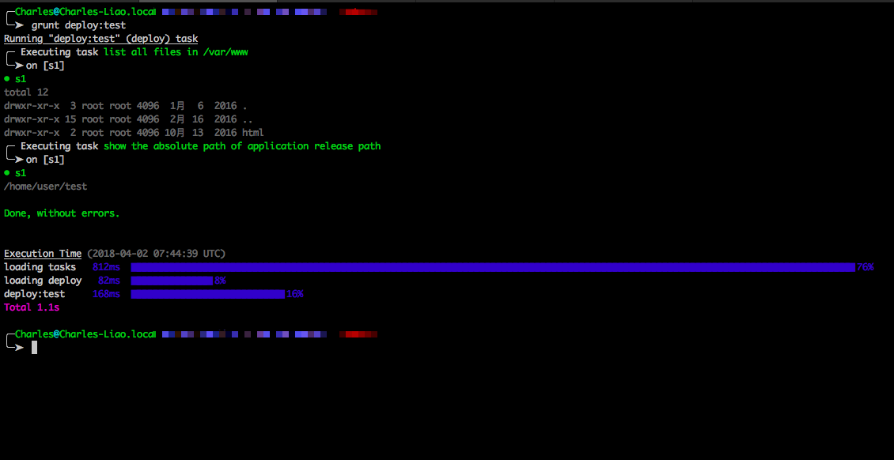

# What this?

A gulp task plugin to deploy application.

# How to install

```bash
$ npm install gulp-dep --save-dev
```

# Configuration

see [node-dep configurations](https://github.com/charleslxh/node-dep).

# Example

```js
var gulp = require('gulp');
var dep = require('gulp-dep');

var options = {
    "tasks": [
        {
            "name": "list all files in /var/www",
            "command": "ls -la",
            "priority": 0,
            "stages": ["prod", "test"],
            "workDir": "/var/www"
        }
    ,
        {
            "name": "show the absolute path of application release path",
            "command": "pwd",
            "priority": 0,
            "stages": ["prod", "test"]
        }
    ],
    "proxy": {
        "host": "192.168.51.222",
        "port": 22,
        "username": "proxy_user_name",
        "privateKey": fs.readFileSync(path.resolve(os.homedir(), ".ssh/id_rsa"))
    },
    "servers": [
        {
            "useProxy: false",
            "stage": "test",
            "releasePath": "/var/www/app",
            "connectOptions": {
                "name": "s1",
                "host": "192.168.51.223",
                "port": 22,
                "username": "user",
                "password": "123456"
            }
        }
    ]
}

gulp.task('deploy', function(cb) {
    dep(options, cb);
});

```

The result:


